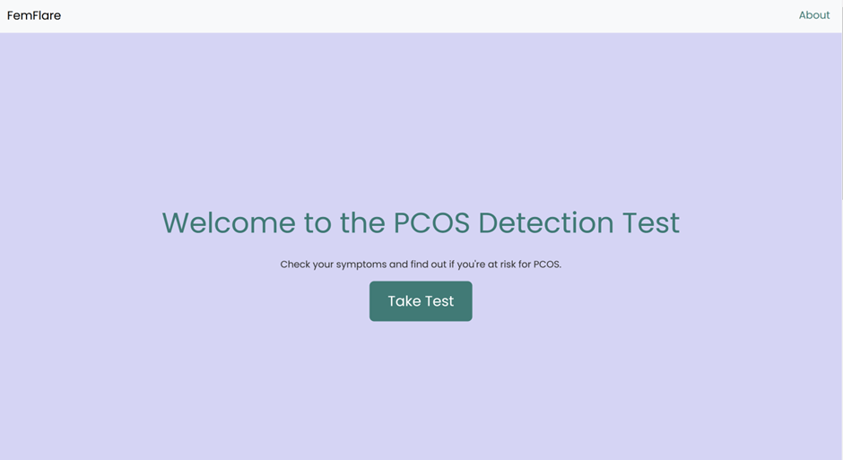
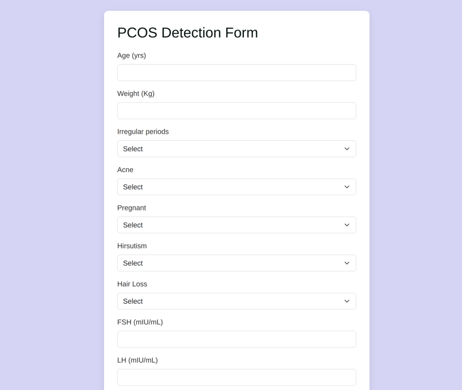

# FemFlare - PCOS Detection System

This project implements machine learning models to detect Polycystic Ovary Syndrome (PCOS) using both clinical data and ultrasound images.

## Model Architecture

The system uses three specialized models:

1. **ANN (Artificial Neural Network)**:
   - Processes clinical data (hormone levels, symptoms, etc.)
   - Structured data analysis for comprehensive patient evaluation
   - 3 hidden layers with ReLU activation

2. **CNN (Convolutional Neural Network)**:
   - Analyzes ultrasound images for ovarian morphology
   - Detects follicular patterns characteristic of PCOS
   - Uses transfer learning with ImageNet weights

3. **Hybrid Model**:
   - Combines predictions from both ANN and CNN
   - Weighted ensemble for final diagnosis
   - Provides more accurate results than individual models

## Model Performance Metrics

### Artificial Neural Network (ANN) Model
- **Accuracy**: 0.93
- **Precision score**: 0.94
- **Recall score**: 0.95  
- **F1 score**: 0.96

### Convolutional Neural Network (CNN) Model
- **Accuracy**: 0.85
- **Precision score**: 0.84
- **Recall score**: 0.80
- **F1 score**: 0.82

### Hybrid Model (ANN + CNN)
- **Accuracy**: 0.93

## Project Structure

```
PCOD_Detection/
├── .gitignore
├── app.py
├── Procfile
├── README.md
├── requirements.txt
├── runtime.txt
├── vercel.json
├── ml_model/
│   ├── ann_for_pcos.py
│   ├── ann_model.keras
│   ├── ann_scaler.pkl
│   ├── cnn_model.keras
│   ├── cnn.py
│   ├── hybrid.py
│   ├── PCOS.csv
│   └── pcos_ultrasound/
│       ├── single_prediction/
│       │   └── img4.jpg
│       ├── test/
│       │   ├── infected/ (multiple .jpg files)
│       │   └── non_infected/ (multiple .jpg files)
│       └── training/
│           └── infected/ (multiple .jpg files)
├── static/
│   ├── css/
│   │   └── index_css.css
│   ├── images/
│   │   ├── 2.jpg
│   │   ├── 4.png
│   │   └── 5.png
│   └── js/
│       └── index_js.js
└── templates/
    ├── index.html
    ├── predict.html
    └── results.html
```

## Application Screenshots

### Home Page


### Prediction Form


### Results Display


## Setup Instructions

1. Clone the repository:
```bash
git clone [repository-url]
cd PCOD_Detection
```

2. Set up the virtual environment if needed
```bash
python -m venv env
.\env\Scripts\activate
```

3. Install dependencies:
```bash
pip install -r requirements.txt
```

4. Run the application:
```bash
python app.py
```

The application will be available at `http://localhost:5000`
